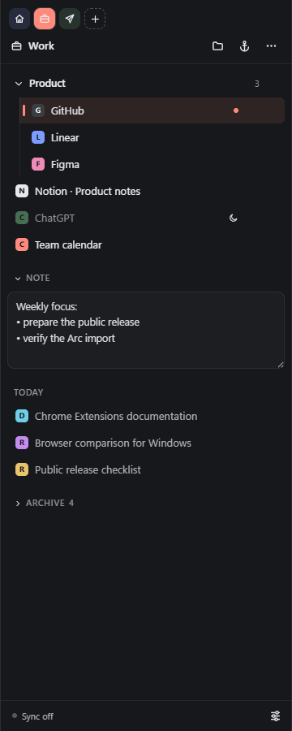
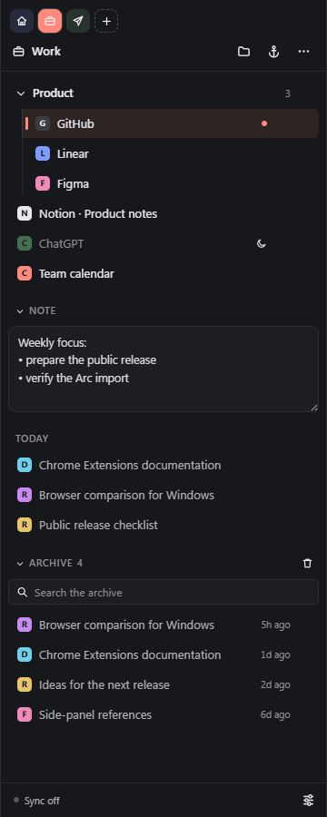
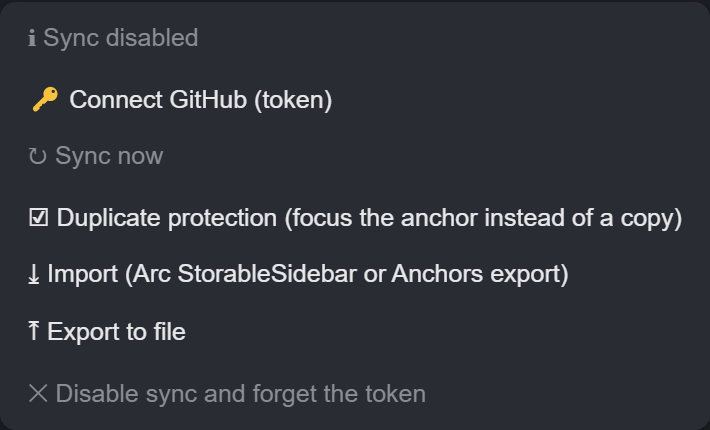

# Anchors — Arc-style tabs for Chromium

Anchors brings the pinned-tab and space workflow from Arc to Chrome, Edge,
Brave, and Vivaldi. It is a lightweight Manifest V3 extension with a compact
side panel: every anchor has a saved home URL, while regular tabs stay in the
Today section of their Space. By default, anchors reuse one live browser tab per
window instead of filling the native tab strip.

Current version: **0.9.1**.



| Tab archive | Settings and sync |
| --- | --- |
|  |  |

_The screenshots use fictional demo data._

## Features

- **Anchor tabs.** Click an anchor to open it in the window's reusable anchor
  tab. Click the active anchor again to return it to the saved home URL. Enable
  **Keep anchor tabs open** to give every opened anchor a separate browser tab.
- **Spaces.** Every space has a name, color, custom icon, anchor collection,
  note, and its own Today tabs. Switching Spaces restores the last tab used in
  that Space without syncing device-local tab IDs.
- **Favorites.** Keep up to 12 global anchor tabs above the Space rail. They
  retain the anchor home-page lifecycle and sync through the encrypted Gist.
- **Command Palette.** Press `Ctrl+K`, `Command+K`, or `/` while the panel is
  focused to search Favorites, Spaces, anchors, Today tabs, the archive, and
  common actions from one keyboard-driven surface.
- **Folders and ordering.** Group anchors into one-level folders and reorder
  items with drag and drop.
- **Today.** Open, close, favorite, pin, or move regular web tabs between
  Spaces in the current window. Restored tabs recover their Space through
  Chromium session metadata.
- **Auto-reset.** Return an inactive anchor to its home URL after a configurable
  interval.
- **Sleep.** Discard inactive anchor tabs with Chromium's `tabs.discard` API.
- **Duplicate protection.** Focus an existing anchor instead of keeping a new
  tab that opened the same home URL.
- **Automatic archive.** Close old unbound tabs and keep them in a searchable,
  restorable local archive.
- **Anchor actions.** Rename, move to a separate window, replace the home URL
  with the current page, or clear site data for that origin.
- **Import and export.** Import Arc `StorableSidebar.json` files or Anchors JSON
  exports.
- **Encrypted sync.** Sync Favorites, spaces, anchors, settings, and notes
  through an end-to-end encrypted GitHub Gist.

### Tab lifecycle

The default mode keeps at most one bound anchor tab in each browser window.
Switching from anchor A to anchor B reuses that tab and navigates it to B's
saved home page. A popped-out anchor remains the single anchor tab of its new
window.

The **Keep anchor tabs open** setting restores the original behavior: every
opened anchor keeps a separate tab until the user closes it. **Sleep** can
discard those tabs to save memory, but does not remove them from the tab strip.
Auto-archive only closes regular, unbound tabs.

Unpinning an anchor or deleting its space never closes a possibly important
page. Its live tab becomes a regular Today tab and starts a fresh auto-archive
timer instead.

## Installation

### Chrome, Edge, and Brave

1. Download the source from GitHub Releases or clone the repository.
2. Open `chrome://extensions` or `edge://extensions`.
3. Enable Developer mode.
4. Select **Load unpacked** and choose the project directory.
5. Click the Anchors toolbar action to open the browser Side Panel.

### Vivaldi

1. Open `vivaldi://extensions`, enable Developer mode, and load the project
   directory as an unpacked extension.
2. Copy the extension ID from its card.
3. Add a Vivaldi Web Panel with this address:

   ```text
   chrome-extension://<ID>/panel.html
   ```

`Ctrl+Shift+H` may not work in Vivaldi because its extension-command support is
limited. The `⌂` button and a second click on the active anchor always provide
the same Go Home action.

## Importing from Arc

1. Locate Arc's `StorableSidebar.json` profile file.
2. In Anchors, select `⚙` → **Import** and choose the file.
3. Imported spaces are appended to the existing Anchors data.

Anchors imports non-empty spaces and their pinned items. Nested folders are
flattened to one level. Arc browsing history and unpinned tabs are not imported.

Import files are limited to 5 MiB and validated completely before Anchors writes
anything. Imports accept only HTTP(S) URLs, bounded text and counts, known data
shapes, and one-level folders. New IDs are generated for imported records so a
file cannot take over existing live tab bindings.

An Anchors export contains Favorites, spaces, anchors, folders, and notes. It does not
contain the local archive, GitHub token, or sync encryption key.

## GitHub Gist sync

Anchors deliberately keeps sidebar data out of browser sync. An encrypted Gist
provides one consistent cross-device channel for Chrome, Edge, Brave, and
Vivaldi:

1. Create a GitHub Personal Access Token with the minimum Gist access: a
   fine-grained token with **Gists: Read and write**, or a classic token with
   only the `gist` scope.
2. Open `⚙` → **Connect GitHub** and enter the token.
3. Select **Generate encryption key**, then save the copied recovery key in a
   password manager.
4. Select **Sync now**. Anchors creates a secret Gist containing
   `anchors-sync.enc.json`, or discovers an existing encrypted Anchors Gist.

On another device, connect a GitHub token for the same account, select
**Use existing encryption key**, paste the recovery key, and then sync. A
separate minimum-scope token per device makes individual revocation possible.

Anchors schedules a push about 30 seconds after a local edit and checks for
remote updates about every 5 minutes. Each encrypted snapshot carries a random
revision and a bounded parent lineage. Content hashes let Anchors distinguish
local-only, remote-only, and concurrent changes. A concurrent change stops
automatic sync and asks whether to keep this device or use the other device;
it is never overwritten silently. Conflict resolution operates on the complete
snapshot rather than merging individual anchors.

Gist snapshots are end-to-end encrypted with AES-256-GCM using a fresh random
nonce for every write. GitHub receives an envelope containing ciphertext and
non-secret format metadata; it does not receive the key. An incorrect key
fails authenticated decryption before Anchors can overwrite remote data.

The GitHub token and encryption key are stored only in `chrome.storage.local`.
They are never written to browser sync, the Gist, or an Anchors export, and the
extension does not additionally encrypt them on the local device. Use a
minimum-scope token and revoke it in GitHub when it is no longer needed. Keep
the encryption key in a password manager: without it, an encrypted Gist cannot
be recovered on a new device.

Older `anchors-sync.json` Gists contain plaintext. Anchors never silently
overwrites one. After confirmation, it selects the newer local or remote
snapshot, creates a new encrypted Gist, switches sync to it, and only then
deletes the old plaintext Gist. If deletion fails, Anchors leaves encrypted
sync active and reports that the old Gist still needs manual removal.

See the [official GitHub Gists API documentation](https://docs.github.com/en/rest/gists/gists).

## Permissions

| Permission | Why Anchors needs it |
| --- | --- |
| `tabs` | Read tab URL, title, and favicon; create, focus, close, and discard tabs. |
| `storage` | Store spaces, anchors, settings, notes, the archive, and runtime bindings. |
| `sessions` | Restore each open Today tab to its device-local Space after a browser restart. |
| `alarms` | Run auto-reset, suspension, archiving, and background Gist sync. |
| `favicon` | Load site icons through Chromium's internal favicon API. |
| `sidePanel` | Display Anchors in the browser Side Panel. |
| `browsingData` | Clear storage and related-domain cookies for one selected site after explicit confirmation. |

The only host permission is `https://api.github.com/*`, used for optional Gist
sync. Anchors does not request access to every website.

Site-data cleanup runs only from the menu of a specific anchor. Anchors does not
delete browsing history or passwords, does not inject content scripts into web
pages, and displays a confirmation that cookies for related subdomains may also
be removed. See [PRIVACY.md](PRIVACY.md) and Chromium's documentation for
[`browsingData`](https://developer.chrome.com/docs/extensions/reference/api/browsingData),
and [`sidePanel`](https://developer.chrome.com/docs/extensions/reference/api/sidePanel).

## Data storage

- `chrome.storage.local`: Favorites, space metadata, settings, anchors,
  folders, notes, the archive, and Gist configuration, including the token and encryption key.
  Large anchor lists remain split into chunks.
- `chrome.storage.sync`: no active application data. On upgrade, Anchors copies
  a newer legacy plaintext snapshot to local storage and then removes the old
  browser-sync keys.
- `chrome.storage.session`: per-window active Spaces, current tab IDs, Today
  assignments, anchor activity times, and the age of regular tabs.
- `chrome.sessions` tab values: the Space ID of each open Today tab, used only
  to recover local assignments when Chromium restores a browser session.

The archive is local, does not sync between devices, and keeps up to 500 items.
Persistent data remains subject to the browser's `chrome.storage.local` quota.
All three storage areas are restricted to trusted extension contexts. Incognito
mode is disabled, so private-window tabs and URLs are never added to Anchors.

## Localization

The extension uses Chrome i18n. English is the default and currently bundled
locale. Chromium automatically selects a matching browser locale when a
translation exists under `_locales`, and falls back to English otherwise.

## Project structure

- `panel.html`, `panel.css`, `panel.js` — side-panel UI;
- `background.js` — service worker and tab maintenance;
- `tab-state.js` — deterministic anchor-tab lifecycle transitions;
- `workspace-state.js` — deterministic per-window Space and Today transitions;
- `palette.js` — Command Palette search ranking;
- `data-schema.js` — validation and limits for imports and synchronized data;
- `shared.js` — persistent and session storage;
- `sync.js` — GitHub Gist synchronization;
- `tests/` — dependency-free lifecycle tests using Node's built-in test runner;
- `_locales/` — Chrome i18n messages;
- `icons/` — the Anchors brand and extension icon assets;
- `DESIGN.md` — visual tokens, component states, and responsive rules;
- `manifest.json` — Manifest V3 configuration.

There is no build step or runtime dependency. Run `npm test` for the lifecycle
tests, then reload the unpacked extension from the browser's extension-management
page.

## Known limitations

- Anchors targets Chromium-based browsers.
- Live tab bindings do not survive a browser restart. Anchors reattaches a
  restored tab that is still on the exact home URL; otherwise the next click
  opens or reuses an anchor tab.
- Today-to-Space assignments survive normal Chromium session restore but are
  device-local and are never synchronized through Gist.
- A live anchor is bound to one browser tab globally. Selecting that same
  anchor from another window focuses its existing tab and window.
- The automatic-archive age counter starts again after a browser restart.
- Gist conflicts are resolved as complete snapshots; there is no field-level merge.
- Folders support one level of nesting.

## License

[MIT](LICENSE)
